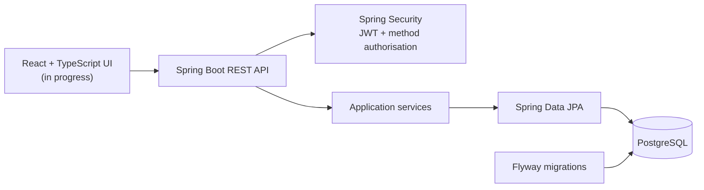

# CaseFlow Ops

[](https://github.com/zxl3011/caseflow-ops/actions/workflows/ci.yml)

CaseFlow Ops is an in-progress legal matter workflow platform for a small Australian law firm. It is designed to demonstrate secure case access, staff assignment and auditable workflow decisions rather than act as a production legal service.

Only synthetic development data is used.

## Current status

Implemented:

- BCrypt credential verification and stateless JWT authentication
- `PARTNER`, `LAWYER`, `PARALEGAL` and `CLIENT` security roles
- role-based and case-level access control
- client ownership checks
- Draft case creation by Partners and Lawyers
- Lead Lawyer, Assisting Lawyer and Paralegal assignments
- Partner/Lawyer client creation with case-insensitive duplicate protection
- Partner/Lawyer paginated client directory listing (`GET /api/clients`), with stable name/id ordering and role-based access control
- Flyway-managed PostgreSQL schema evolution
- unit, web-security and PostgreSQL integration tests
- GitHub Actions quality gates for backend tests and frontend lint/build

In progress:

- client portal linking and updates
- case status transitions
- React authentication and protected routes

Planned:

- document review workflows
- hearing and limitation-date scheduling
- audit logging
- operational dashboards

The backend vertical slices are functional. The React frontend is currently a Vite scaffold and is not yet integrated with the API.

## Architecture



The security model combines role-based access control with relationship-based checks. For example, having the `LAWYER` role is not sufficient to view every case; the lawyer must also be assigned to that case.

## Design decisions

| Decision | Rationale | Trade-off |
|---|---|---|
| [Reload the current user after JWT validation](docs/decisions/0001-reload-users-during-jwt-authentication.md) | A valid token should not preserve access after an account is deleted or a role changes. The token identifies the user, while PostgreSQL remains the source of truth for current authorities. | Each authenticated request performs a database lookup. A higher-scale version could use short-lived caching or token-version checks. |
| [Combine roles with case relationships](docs/decisions/0002-combine-roles-with-case-relationships.md) | Roles define broad capabilities, but lawyers and paralegals receive case access only through assignments and clients only through ownership. This avoids granting every user with the same role access to every matter. | Authorisation requires relationship queries, and a future multi-tenant version must add an explicit firm boundary. |
| [Enforce authorisation at the service boundary](docs/decisions/0004-enforce-authorisation-at-service-boundary.md) | Protecting application use cases rather than only HTTP routes keeps the rules effective when a service is reused by another controller, job or delivery mechanism. | Method-security tests must call Spring-managed service proxies, and policy checks may add database work. |
| [Return explicit response models](docs/decisions/0005-use-client-safe-response-models.md) | DTOs prevent JPA relationships and internal legal notes from being exposed accidentally, while allowing the persistence model and API contract to evolve independently. | Mapping code is required, and different audiences may eventually need separate response models. |
| Enforce important invariants in both the application and PostgreSQL | An early application check produces a useful `409 Conflict`, while database constraints remain the final safeguard against concurrent duplicate requests. `saveAndFlush()` evaluates the constraint inside the service transaction so it can be translated consistently. | Some validation is intentionally duplicated, but the database remains authoritative when concurrent requests race. |
| Keep multi-write workflows transactional | Draft case creation and automatic Lead Lawyer assignment succeed or roll back together, preventing partially created workflows. | Transaction boundaries must stay in the service layer and should not include slow external operations. |
| [Keep applied Flyway migrations immutable](docs/decisions/0003-keep-flyway-migrations-immutable.md) | Append-only migrations preserve checksums and make schema history reproducible across local, CI and future deployed environments. | Even small schema corrections require a new numbered migration. |

The detailed context and consequences for significant choices are maintained in the [architecture decision records](docs/decisions/README.md).

## Technology

- Java 21 and Spring Boot
- Spring Security and JJWT
- Spring Data JPA and Hibernate
- PostgreSQL 16 and Flyway
- JUnit, MockMvc and Spring Security Test
- React, TypeScript and Vite
- Docker Compose
- GitHub Actions continuous integration

## Run locally

Prerequisites:

- Java 21 (Temurin recommended; the repository includes `.java-version`)
- Docker with Docker Compose
- Node.js 22 for frontend work

Start PostgreSQL:

```bash
docker compose up -d postgres
```

Run the backend:

```bash
cd backend
./mvnw spring-boot:run
```

The API starts at `http://localhost:8080`. Check it with:

```bash
curl http://localhost:8080/api/health
```

Run the test suite:

```bash
cd backend
./mvnw test
```

Start the frontend scaffold:

```bash
cd frontend
npm ci
npm run dev
```

Before opening a pull request, run the local quality checks:

```bash
cd backend
./mvnw test

cd ../frontend
npm run lint
npm run build
```

Database and JWT settings use environment variables in deployed or CI environments while retaining synthetic local-development defaults. See `application.properties` for the supported variable names.

## Development-only users

The current development seeder creates synthetic users with the shared password `password123`:

| Role | Email |
|---|---|
| Partner | `partner@example.com` |
| Lawyer | `lawyer@example.com` |
| Paralegal | `paralegal@example.com` |
| Client | `client@example.com` |

These accounts are development fixtures, not production credentials. Moving the seeder behind a development-only profile is tracked as security hardening work.

## Documentation

- [Project overview](docs/01-project-overview.md)
- [Requirements and permissions](docs/02-requirements.md)
- [Architecture](docs/03-architecture.md)
- [Database design](docs/04-database-design.md)
- [API design](docs/05-api-design.md)
- [Development workflow and definition of done](docs/06-development-workflow.md)
- [Architecture decision records](docs/decisions/README.md)

## Project boundaries

CaseFlow Ops currently assumes a single law firm. A multi-tenant deployment would require an explicit firm/workspace boundary on users, clients, cases and every authorisation query.
