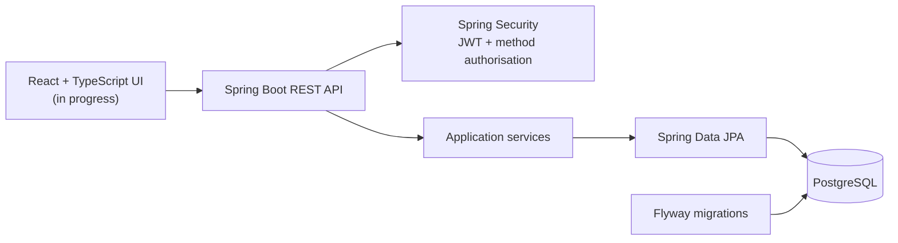

# CaseFlow Ops

CaseFlow Ops is an in-progress legal matter workflow platform for a small Australian law firm. It is designed to demonstrate secure case access, staff assignment and auditable workflow decisions rather than act as a production legal service.

Only synthetic development data is used.

## Current status

Implemented:

- BCrypt credential verification and stateless JWT authentication
- `PARTNER`, `LAWYER`, `PARALEGAL` and `CLIENT` security roles
- role-based and case-level access control
- client ownership checks
- Draft case creation by Partners and Lawyers
- Lead Lawyer, Assisting Lawyer and Paralegal assignments
- Flyway-managed PostgreSQL schema evolution
- unit, web-security and PostgreSQL integration tests

In progress:

- client management
- case status transitions
- React authentication and protected routes

Planned:

- document review workflows
- hearing and limitation-date scheduling
- audit logging
- operational dashboards

The backend vertical slices are functional. The React frontend is currently a Vite scaffold and is not yet integrated with the API.

## Architecture



The security model combines role-based access control with relationship-based checks. For example, having the `LAWYER` role is not sufficient to view every case; the lawyer must also be assigned to that case.

## Technology

- Java 21 and Spring Boot
- Spring Security and JJWT
- Spring Data JPA and Hibernate
- PostgreSQL 16 and Flyway
- JUnit, MockMvc and Spring Security Test
- React, TypeScript and Vite
- Docker Compose

## Run locally

Prerequisites:

- Java 21+
- Docker with Docker Compose
- Node.js for frontend work

Start PostgreSQL:

```bash
docker compose up -d postgres
```

Run the backend:

```bash
cd backend
./mvnw spring-boot:run
```

The API starts at `http://localhost:8080`. Check it with:

```bash
curl http://localhost:8080/api/health
```

Run the test suite:

```bash
cd backend
./mvnw test
```

Start the frontend scaffold:

```bash
cd frontend
npm install
npm run dev
```

## Development-only users

The current development seeder creates synthetic users with the shared password `password123`:

| Role | Email |
|---|---|
| Partner | `partner@example.com` |
| Lawyer | `lawyer@example.com` |
| Paralegal | `paralegal@example.com` |
| Client | `client@example.com` |

These accounts are development fixtures, not production credentials. Moving the seeder behind a development-only profile is tracked as security hardening work.

## Documentation

- [Project overview](docs/01-project-overview.md)
- [Requirements and permissions](docs/02-requirements.md)
- [Architecture](docs/03-architecture.md)
- [Database design](docs/04-database-design.md)
- [API design](docs/05-api-design.md)
- [Architecture decision records](docs/decisions/README.md)

## Project boundaries

CaseFlow Ops currently assumes a single law firm. A multi-tenant deployment would require an explicit firm/workspace boundary on users, clients, cases and every authorisation query.
