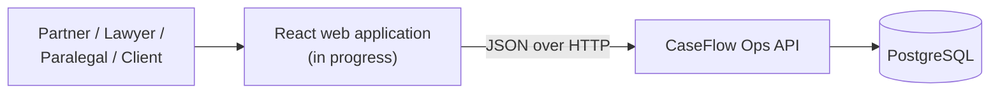
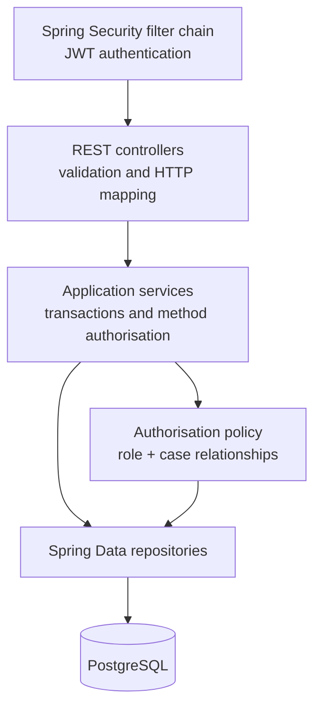
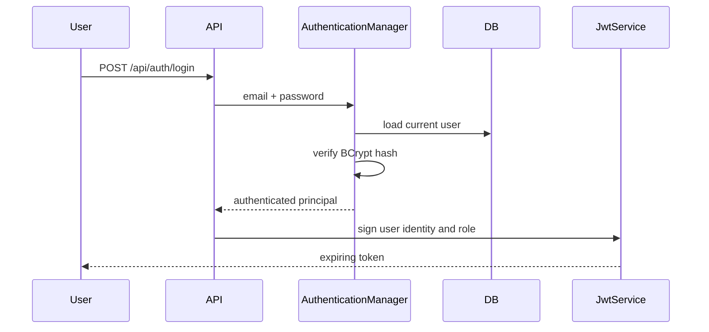
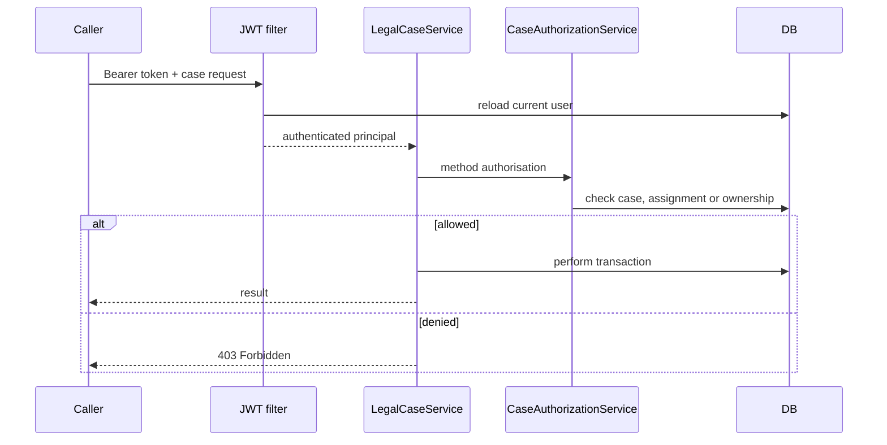

# Architecture

## System context

The current implementation is a modular monolith. This keeps transactions and authorisation rules explicit while the product model is still evolving.

## Backend layers

### Package responsibilities

| Package | Responsibility |
|---|---|
| `auth` | Login requests, responses and current-user endpoint |
| `security` | JWT handling, authenticated principal and HTTP security errors |
| `user` | User identity and application role |
| `client` | Client records and their optional portal-user link |
| `legalcase` | Cases, assignments, business rules and case authorisation |
| `config` | Spring Security and development fixture configuration |

## Authentication flow

For each protected request, `JwtAuthenticationFilter` validates the signature and expiry, reloads the current user, converts the current role to a Spring Security authority and establishes the `SecurityContext`.

Reloading the user means deleted users and role changes take effect without waiting for an existing token to expire.

## Authorisation flow

Authorisation is enforced on service methods so another delivery mechanism cannot bypass the policy simply by calling the service directly.

## Transaction boundaries

- read operations use read-only service transactions
- case creation saves the case and initial Lead Lawyer assignment atomically
- staff assignment relies on both an application check and a database unique constraint
- Open Session in View is disabled; required relationships are loaded within the service transaction

## Current constraints

- the system is single-firm; there is no tenant identifier yet
- the frontend is not integrated
- development users are seeded outside a dedicated profile
- access tokens do not yet have refresh or revocation workflows
- client management and case status transitions are not implemented

## Related decisions

- [ADR-0001: Reload users during JWT authentication](decisions/0001-reload-users-during-jwt-authentication.md)
- [ADR-0002: Combine roles with case relationships](decisions/0002-combine-roles-with-case-relationships.md)
- [ADR-0003: Keep Flyway migrations immutable](decisions/0003-keep-flyway-migrations-immutable.md)
- [ADR-0004: Enforce authorisation at the service boundary](decisions/0004-enforce-authorisation-at-service-boundary.md)
- [ADR-0005: Use client-safe response models](decisions/0005-use-client-safe-response-models.md)
