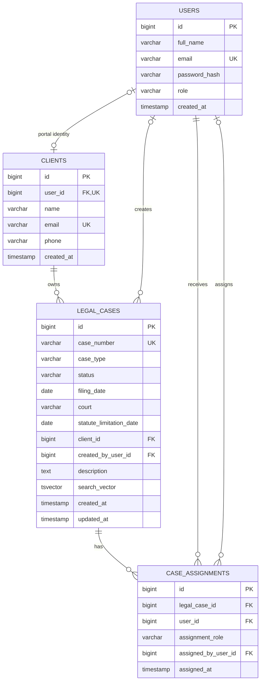

# Database design

PostgreSQL is the source of truth. Hibernate validates the mapped schema, while Flyway owns schema creation and evolution.

## Current entity relationship model

## Core invariants

- user email is unique
- client email is unique case-insensitively
- a portal user can link to at most one client record
- case number is unique
- every case belongs to one client
- a case can have multiple staff assignments
- a user can have at most one assignment on a case
- assignment role is one of `LEAD_LAWYER`, `ASSISTING_LAWYER` or `PARALEGAL`
- deleting a case cascades to its assignments
- a Draft case may have no filing date

Role compatibility is currently enforced in the application service. The database constrains valid assignment-role values and duplicate relationships.

## Migration history

### V1 — initial schema

Created:

- `users`
- `clients`
- `legal_cases`
- PostgreSQL full-text search index

The initial case model stored a single `partner_id` and `paralegal_id`.

### V2 — assignments and client users

- linked an optional application user to a client record
- created the many-to-many `case_assignments` relationship
- migrated existing Partner and Paralegal links
- removed the single-person case columns

This change supports multiple lawyers and paralegals on one case.

### V3 — Draft case creation

- made `filing_date` optional for Draft cases
- recorded the user who created a case
- backfilled creation ownership from existing Lead Lawyer assignments where available

### V4 — case-insensitive client email

- normalised existing client emails to lowercase
- added a unique functional index on `LOWER(email)`
- retained the database as the final duplicate-email guard during concurrent requests

## Migration policy

An applied migration is immutable. Schema corrections are made in a new migration rather than editing V1, V2, V3 or V4. This preserves checksums and makes every environment reproducible.

## Planned database work

- explicit case-status constraints and transition history
- audit event table
- document metadata and visibility classification
- deadlines and hearings
- firm/workspace tenant boundary
